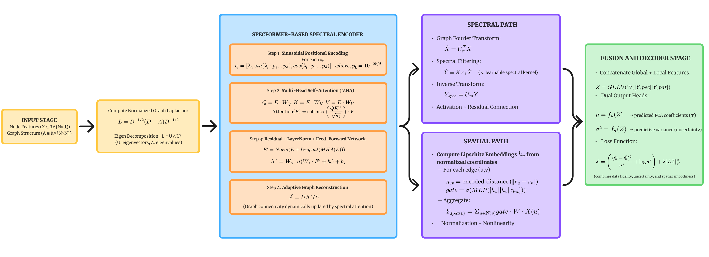

# Specformer-Guided-Spatial-Spectral-Graph-Neural-Operator-S3GNO-

# Specformer-Guided Spectral–Spatial Graph Neural Operator (S3GNO)

## 📘 Overview
This repository contains the implementation of the **Specformer-Guided Spectral–Spatial Graph Neural Operator (S3GNO)** — a novel hybrid graph neural operator that integrates **transformer-based spectral adaptation** with **spatial message passing** to predict **blast load time-series** on complex structural geometries such as steel box girders.

The model dynamically learns graph topology in the **spectral domain** using a transformer encoder (Specformer), enabling robust modeling of **long-range dependencies**, **non-local wave interactions**, and **uncertainty-aware predictions**.  
S3GNO is benchmarked against two state-of-the-art baselines:
- **PCA–GNN** (Qiu & Du, *Reliability Engineering & System Safety*, 2025)
- **Sp2GNO** (Sarkar & Chakraborty, *Computer Methods in Applied Mechanics & Engineering*, 2024)

---

## 🧩 Key Features
- **Dynamic Spectral Adaptation** via Specformer-guided eigenvalue attention  
- **Dual-path Spectral–Spatial Operator** combining Graph Fourier filtering and gated message passing  
- **Uncertainty-aware decoding** with mean and variance prediction  
- **Physically consistent topology learning** for irregular structural domains  
- **Benchmarking framework** comparing S3GNO, Sp2GNO, and PCA–GNN on a common dataset  

---

## 🏗️ Model Architecture
<p align="center">
  
</p>

**Figure:** Architecture of the proposed S3GNO integrating Specformer-based spectral adaptation with dual spectral–spatial operator paths for uncertainty-aware blast load prediction.

---

## ⚙️ Installation
### Prerequisites
- Python 3.8+
- PyTorch ≥ 2.0
- PyTorch Geometric
- NumPy, Pandas, Matplotlib
- scikit-learn, tqdm, joblib

### Setup
```bash
git clone https://github.com/<your-repo>/S3GNO.git
cd S3GNO
pip install -r requirements.txt
